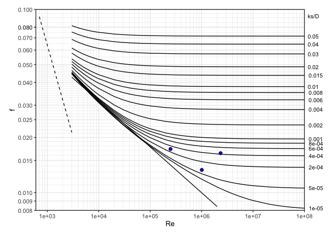

<!-- README.md is generated from README.Rmd. Please edit that file -->

# Description

The *hydraulics* R package contains functions to 1) describe properties
of water, 2) solve the Darcy-Weisbach equation for friction loss through
pipes, and 3) plot a Moody diagram. The format of functions and
solutions are designed to be compatible with the *iemisc* package that
includes open channel hydraulics solutions.

# Installation

``` r
#Install this package
devtools::install_github("EdM44/hydraulics")
```

# Examples (see more examples in the function descriptions)

``` r
library("hydraulics")
```

## 1\) Type 1 problem (solve for friction loss): Eng (US) units

``` r
D <- 20/12  
L <- 10560
Q <- 4
T <- 60
ks <- 0.0005

#Optionally, use utility functions to find the Reynolds Number and friction factor, f:
reynolds_number(V = velocity(D, Q), D = D, nu = kvisc(T = T, units = "Eng"))
#> [1] 248624.7
colebrook(ks = ks, V = velocity(D, Q), D = D, nu = kvisc(T = T, units = "Eng"))
#> Colebrook f: 0.0173
#> [1] 0.0173031

#Solve directly for the missing value of friction loss 
ans1 <- darcyweisbach(Q = Q,D = D, L = L, ks = ks, nu = kvisc(T=T, units="Eng"), units = c("Eng"))
#> hf missing: solving a Type 1 problem
#> Colebrook f: 0.0173
cat(sprintf("Reynolds no: %.0f\nFriction Fact: %.4f\nHead Loss: %.2f\n", ans1$Re, ans1$f, ans1$hf))
#> Reynolds no: 248625
#> Friction Fact: 0.0173
#> Head Loss: 5.72
```

## 2\) Type 2 (solving for flow rate, Q): SI Units

``` r
D <- .5
L <- 10
hf <- 0.006*L
T <- 20
ks <- 0.000046
ans2 <- darcyweisbach(D = D, hf = hf, L = L, ks = ks, nu = kvisc(T=T, units='SI'), units = c('SI'))
#> Q missing: solving a Type 2 problem
#> Colebrook f: 0.0133
cat(sprintf("Reynolds no: %.0f\nFriction Fact: %.4f\nFlow: %.2f\n", ans2$Re, ans2$f, ans2$Q))
#> Reynolds no: 1010337
#> Friction Fact: 0.0133
#> Flow: 0.41
```

## Type 3 (solving for diameter, D): Eng (US) units

``` r
Q <- 37.5     #flow in ft^3/s
L <- 8000     #pipe length in ft
hf <- 215     #head loss due to friction, in ft
T <- 68       #water temperature, F
ks <- 0.0008  #pipe roughness, ft
ans3 <- darcyweisbach(Q = Q, hf = hf, L = L, ks = ks, nu = kvisc(T=T, units='Eng'), units = c('Eng'))
#> D missing: solving a Type 3 problem
#> Colebrook f: 0.0164
cat(sprintf("Reynolds no: %.0f\nFriction Fact: %.4f\nDiameter: %.2f\n", ans3$Re, ans3$f, ans3$D))
#> Reynolds no: 2336974
#> Friction Fact: 0.0164
#> Diameter: 1.85
```

## Utility functions for water properties can be used independently as well:

## Find kinematic viscocity for water temperature of 55 F

``` r
nu = kvisc(T = 55, units = 'Eng')
```

## Find kinematic viscocity assuming default water temperature of 68 F

``` r
nu = kvisc(units = 'Eng')
#> 
#> Temperature not given.
#> Assuming T = 68 F
```

## Find water density for water temperature of 25 C

``` r
rho = kvisc(T = 25, units = 'SI')
```

## plot a Moody diagram, with optional points added

``` r
moody(Re = c(ans1$Re, ans2$Re, ans3$Re), f = c(ans1$f, ans2$f, ans3$f))
```


