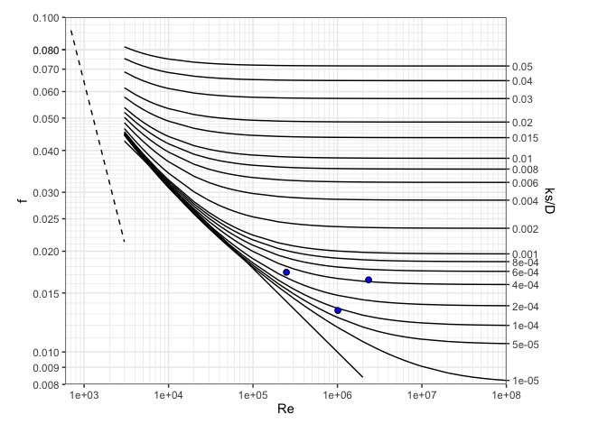

<!-- README.md is generated from README.Rmd. Please edit that file -->

# Description

The *hydraulics* R package solves basic pipe hydraulics for both
pressure and gravity flow conditions, and open-channel hydraulics for
trapezoidal channels, including triangular and rectangular. Pressure
pipe solutions include functions to 1) describe properties of water, 2)
solve the Darcy-Weisbach equation for friction loss through pipes, and
3) plot a Moody diagram. Partially-filled pipe and other open-channel
flow solutions are solved with the Manning equation. The format of
functions and pressure pipe solutions are designed to be compatible with
the *iemisc* package, and the open channel hydraulics solutions are
modifications of code in that package.

# Installation

``` r
#Install the stable CRAN version of this package
install.packages("hydraulics")
#Install the development version of this package
devtools::install_github("EdM44/hydraulics")
```

# Examples (see more examples in the function descriptions)

``` r
library(hydraulics)
```

## 1\) Type 1 problem (solve for friction loss): Eng (US) units

``` r
D <- 20/12    #20 inch converted to ft
L <- 10560    #ft
Q <- 4        #ft3/s
T <- 60       #F
ks <- 0.0005  #ft

#Optionally, use utility functions to find the Reynolds Number and friction factor, f:
reynolds_number(V = velocity(D, Q), D = D, nu = kvisc(T = T, units = "Eng"))
#> [1] 248624.7
colebrook(ks = ks, V = velocity(D, Q), D = D, nu = kvisc(T = T, units = "Eng"))
#> [1] 0.0173031

#Solve directly for the missing value of friction loss 
ans1 <- darcyweisbach(Q = Q,D = D, L = L, ks = ks, nu = kvisc(T=T, units="Eng"), units = c("Eng"))
#> hf missing: solving a Type 1 problem
cat(sprintf("Reynolds no: %.0f\nFriction Fact: %.4f\nHead Loss: %.2f ft\n", ans1$Re, ans1$f, ans1$hf))
#> Reynolds no: 248625
#> Friction Fact: 0.0173
#> Head Loss: 5.72 ft
```

## 2\) Type 2 (solving for flow rate, Q): SI Units

``` r
D <- .5         #m
L <- 10         #m
hf <- 0.006*L   #m
T <- 20         #C
ks <- 0.000046  #m
ans2 <- darcyweisbach(D = D, hf = hf, L = L, ks = ks, nu = kvisc(T=T, units='SI'), units = c('SI'))
#> Q missing: solving a Type 2 problem
cat(sprintf("Reynolds no: %.0f\nFriction Fact: %.4f\nFlow: %.2f m3/s\n", ans2$Re, ans2$f, ans2$Q))
#> Reynolds no: 1010337
#> Friction Fact: 0.0133
#> Flow: 0.41 m3/s
```

## Type 3 (solving for diameter, D): Eng (US) units

``` r
Q <- 37.5     #flow in ft^3/s
L <- 8000     #pipe length in ft
hf <- 215     #head loss due to friction, in ft
T <- 68       #water temperature, F
ks <- 0.0008  #pipe roughness, ft
ans3 <- darcyweisbach(Q = Q, hf = hf, L = L, ks = ks, nu = kvisc(T=T, units='Eng'), units = c('Eng'))
#> D missing: solving a Type 3 problem
cat(sprintf("Reynolds no: %.0f\nFriction Fact: %.4f\nDiameter: %.2f ft\n", ans3$Re, ans3$f, ans3$D))
#> Reynolds no: 2336974
#> Friction Fact: 0.0164
#> Diameter: 1.85 ft
```

## Solving for roughness height (ks): Eng (US) units, print results as data frame

``` r
D <- 1.85     #diameter in ft
Q <- 37.5     #flow in ft^3/s
L <- 8000     #pipe length in ft
hf <- 215     #head loss due to friction, in ft
T <- 68       #water temperature, F
ans4 <- darcyweisbach(Q = Q, D = D, hf = hf, L = L, nu = kvisc(T=T, units='Eng'), units = c('Eng'))
#> ks missing: solving for missing roughness height
kable(setNames(as.data.frame(unlist(ans4)),c('value')), format = "html")
```

<table>

<thead>

<tr>

<th style="text-align:left;">

</th>

<th style="text-align:right;">

value

</th>

</tr>

</thead>

<tbody>

<tr>

<td style="text-align:left;">

Q

</td>

<td style="text-align:right;">

3.750000e+01

</td>

</tr>

<tr>

<td style="text-align:left;">

V

</td>

<td style="text-align:right;">

1.395076e+01

</td>

</tr>

<tr>

<td style="text-align:left;">

L

</td>

<td style="text-align:right;">

8.000000e+03

</td>

</tr>

<tr>

<td style="text-align:left;">

D

</td>

<td style="text-align:right;">

1.850000e+00

</td>

</tr>

<tr>

<td style="text-align:left;">

hf

</td>

<td style="text-align:right;">

2.150000e+02

</td>

</tr>

<tr>

<td style="text-align:left;">

f

</td>

<td style="text-align:right;">

1.649880e-02

</td>

</tr>

<tr>

<td style="text-align:left;">

ks

</td>

<td style="text-align:right;">

8.176000e-04

</td>

</tr>

<tr>

<td style="text-align:left;">

Re

</td>

<td style="text-align:right;">

2.335866e+06

</td>

</tr>

</tbody>

</table>

## Utility functions for water properties can be used independently as well:

### Find kinematic viscosity for water temperature of 55 F

``` r
nu = kvisc(T = 55, units = 'Eng')
cat(sprintf("Kinematic viscosity: %.3e ft2/s\n", nu))
#> Kinematic viscosity: 1.318e-05 ft2/s
```

### Find kinematic viscosity assuming default water temperature of 68 F

``` r
nu = kvisc(units = 'Eng')
#> 
#> Temperature not given.
#> Assuming T = 68 F
cat(sprintf("Kinematic viscosity: %.3e ft2/s\n", nu))
#> Kinematic viscosity: 1.105e-05 ft2/s
```

### Find water density for water temperature of 25 C

``` r
rho = dens(T = 25, units = 'SI')
cat(sprintf("Water density: %.3f kg/m3\n", rho))
#> Water density: 997.075 kg/m3
```

## Plot a Moody diagram, with optional points added

``` r
moody(Re = c(ans1$Re, ans2$Re, ans3$Re), f = c(ans1$f, ans2$f, ans3$f))
```



## Open Channel Flow in a Pipe: solving for Q: SI Units

``` r
oc1 <- manningc(d = 0.6, n = 0.013, Sf = 1./400., y = 0.24, units = "SI")
cat(sprintf("Flow rate, Q: %.2f m3/s\nFull pipe flow rate, Qf: %.2f\n", oc1$Q, oc1$Qf))
#> Flow rate, Q: 0.10 m3/s
#> Full pipe flow rate, Qf: 0.31
```

## Open Channel Flow in a Pipe: solving for diameter, d when given y\_d): Eng (US) units

``` r
oc2 <- manningc(Q = 83.5, n = 0.015, Sf = 0.0002, y_d = 0.9, units = "Eng")
cat(sprintf("Required diameter: %.2f ft\nFlow depth: %.2f\n", oc2$d, oc2$y))
#> Required diameter: 7.00 ft
#> Flow depth: 6.30
```

## Plot the cross section for the last example

``` r
xc_circle( y = oc2$y ,d = oc2$d )
```


## Open Channel Flow in a Channel: solving for slope: Eng (US) units

``` r
oc3 <- manningt(Q = 360., n = 0.015, m = 1, b = 20.0, y = 3.0, units = "Eng")
cat(sprintf("Slope: %.5f ft\nCritical depth: %.2f\n", oc3$Sf, oc3$yc))
#> Slope: 0.00088 ft
#> Critical depth: 2.08
```

## Plot a specific energy diagram for the channel of last example

``` r
spec_energy_trap( Q = oc3$Q, b = oc3$b, m = oc3$m, scale = 4, units = "Eng" )
```


## Plot the cross section for the last example

``` r
xc_trap( y = oc3$y, b = oc3$b, m = oc3$m )
```


