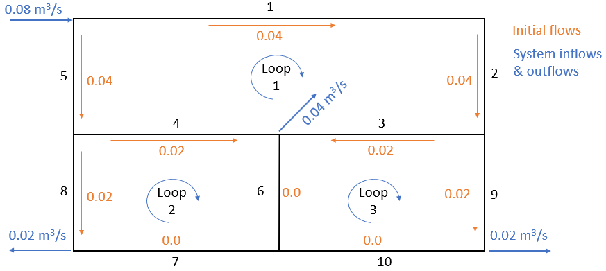

```{r, include = FALSE}
knitr::opts_chunk$set(
  collapse = TRUE,
  comment = "#>"
)
```

```{r setup}
library(hydraulics)
```

# Introduction to the _hydraulics_ package

The _hydraulics_ package was developed to augment education in basic closed conduit and open channel hydraulics. Most common applications in civil engineering involve water flowing under turbulent conditions, so the functions make that assumption. If that assumption is violated, a warning is generated, though that often means there was an input error. Because engineering calculations are burdened by the persistence of U.S. customary (often referred to as English) units, all functions work in either system by designating units as either _SI_ or _Eng_.

## 1.0 Water properties

When describing the behavior of water in pipes and channels under turbulent flow conditions there are three water properties used used in calculations, all of which vary with water temperature: density ($\rho$), dynamic viscosity($\mu$), and kinematic viscosity($\nu$), where they are related by $\nu=\frac{\mu}{\rho}$. An additional function exists for saturated vapor pressure of water.

These properties are found using the _dens_, _dvisc_, _kvisc_, and _svp_ functions. For example, the kinematic viscosity for water temperature of 55 F is found as follows:

```{r waterprops-1}
nu = kvisc(T = 55, units = 'Eng')
cat(sprintf("Kinematic viscosity: %.3e ft2/s\n", nu))
```

Similarly the water density for water temperature of 25 C can be determined by:
```{r waterprops-2}
rho = dens(T = 25, units = 'SI')
cat(sprintf("Water density: %.3f kg/m3\n", rho))
```

The water property functions can all accept a list of input temperature values, enabling visualization of a property with varying water temperature, for example:
```{r waterprops-3, out.width="50%"}
Ts <- seq(0, 100, 10)
nus <- kvisc(T = Ts, units = 'SI')
xlbl <- expression("Temperature, " (degree*C))
ylbl <- expression("Kinematic viscosity," ~nu~ (m^{2}/s))
par(cex=0.8, mgp = c(2,0.7,0))
plot(Ts, nus, xlab = xlbl, ylab = ylbl, type="l")
```

The water property functions can also be called with the _ret_units_ parameter, in which case the function returns an object of class _units_. This enables capabilities for new units being deduced as operations are performed on the values. A concise example of this is in a [blog post by Edzer Pebesma](https://r-spatial.org/r/2016/09/29/plot_units.html), the author of the `units` package.

```{r waterprops-4}
T <- 25
Dens <- dens(T = T, units = 'SI', ret_units = TRUE)
Dvisc <- dvisc(T = T, units = 'SI', ret_units = TRUE)
#Calculate kinematic viscosity and units are generated correctly
Kvisc <- Dvisc / Dens
Kvisc
```

While the units are correct, they are not in their simplified form. That can be done by setting new units. Unit conversions are done the same way.

```{r waterprops-5}
units::set_units(Kvisc, m^2/s)
units::set_units(Kvisc, ft^2/s)
```

An example finding the saturated vapor pressure to water at $10^{o}C$ follows.
```{r waterprops-6}
vps <- svp(T = 10, units = "SI", ret_units = T)
vps
#convert to psi - notice the need to enclose "in" with backticks since "in" 
#has other meanings in R
units::set_units(vps,lbf/`in`^2)
```


If the results are of class _units_ they also can have the units plot without the cumbersome formatting of axis labels.

```{r waterprops-7, out.width="50%"}
Temperature <- units::set_units(seq(0, 100, 10), degree_Celsius)
Kinematic_Viscosity <- kvisc(T = Temperature, units = 'SI', ret_units = TRUE)
par(cex=0.8, mar = par("mar") + c(0, .2, 0, 0))
plot(Temperature, Kinematic_Viscosity, type="l")
```

## 2.0 Fundamental constants

Two of the most important descriptive quantities in engineering hydraulics are the Reynolds number, _Re_ and the Froude number _Fr_. $Re=\frac{VD}{\nu}$ describes the turbulence of the flow. It expresses the ratio of kinematic forces, expressed by velocity _V_ and a characteristic length such as pipe diameter, _D_, to viscous forces as expressed by the kinematic viscosity $\nu$. For open channels the characteristic length is the _hydraulic depth_, the area of flow divided by the top width. For adequately turbulent conditions to exists, Reynolds numbers should exceed 4000 for full pipes, and 2000 for open channels.

For open channel flow, given a channel shape and flow rate, flow can usually exist at two different depths, termed subcritical (slow, deep) and supercritical (shallow, fast). The exception is at critical flow conditions, where only one depth exists, the critical depth. Which depth is exhibited by the flow is determined by the slope and roughness of the channel. The Froude number is defined by $Fr=\frac{V}{\sqrt{gD}}$. _Fr_ characterizes flow as:

```{r constants-1, echo=FALSE}
knitr::kable(data.frame(Fr=c("<1.0","=1.0",">1.0"), Condition=c("subcritical","critical","supercritical")), format="pipe", padding=0)
```

These constants are calculated internally and returned with the output of many functions. Critical flow is important in open-channel flow applications and is discussed further below. 

## 3.0 Friction Loss in Circular Pipes

The energy at any point along a pipe containing flowing water is often described by the energy per unit weight, or energy head, E: $$E = z+\frac{P}{\gamma}+\alpha\frac{V^2}{2g}$$ where P is the pressure, $\gamma=\rho g$ is the specific weight of water, _z_ is the elevation of the point, _V_ is the average velocity, and each term has units of length. $\alpha$ is a kinetic energy adjustment factor to account for non-uniform velocity distribution across the cross-section. $\alpha$ is typically assumed to be 1.0 for turbulent flow because the value is close to 1.0 and $\frac{V^2}{2g}$ (the velocity head) tends to be small in relation to other terms in the equation.

As water flows through a pipe energy is lost due to friction with the pipe walls and local disturbances (minor losses). The energy loss between two sections is expressed as ${E_1} - {h_l} = {E_2}$. When pipes are long, with $\frac{L}{D}>1000$, friction losses dominate the energy loss on the system, and the head loss, $h_l$, is calculated as the head loss due to friction, $h_f$. This energy head loss due to friction with the walls of the pipe is described by the Darcy-Weisbach equation, which estimates the energy loss per unit weight, or head loss ${h_f}$, which has units of length. For circular pipes it is expressed as: $$h_f = \frac{fL}{D}\frac{V^2}{2g} = \frac{8fL}{\pi^{2}gD^{5}}Q^{2}$$
In this equation _f_ is the friction factor, typically calculated with the Colebrook equation: $$\frac{1}{\sqrt{f}} = -2\log\left(\frac{\frac{k_s}{D}}{3.7} + \frac{2.51}{Re\sqrt{f}}\right)$$ where $k_s$ is the absolute roughness of the pipe wall. There are close approximations to the Colebrook equation that have an explicit form to facilitate hand-calculations, but this package only uses the Colebrook function.

Any one of the variables in the Darcy Weisbach equation, and by extension the Colebrook equation, may be treated as an unknown. For an existing pipe with a known flow rate, the friction loss for a length of pipe may be found:

```{r pipe-1}
D <- 20/12    #20 inch converted to ft
L <- 10560    #ft
Q <- 4        #ft^3/s
T <- 60       #degrees F
ks <- 0.0005  #ft

ans <- darcyweisbach(Q = Q,D = D, L = L, ks = ks, 
                     nu = kvisc(T=T, units="Eng"), units = c("Eng"))
cat(sprintf("Reynolds no: %.0f\nFriction Fact: %.4f\nHead Loss: %.2f ft\n", 
            ans$Re, ans$f, ans$hf))
```

The Reynolds number is adequately high to ensure flow is turbulent and the Colebrook equation is valid. As with the water properties function, it can be called with _ret\_units = TRUE_ to return a list of `units` objects (using the same input as above):
```{r pipe-2, message=FALSE, warning=FALSE}
ans <- darcyweisbach(Q = 4.0,D = 20/12, L = 10560, ks = 0.0005, nu = kvisc(T=T, units="Eng"),
                     units = "Eng", ret_units = TRUE)
knitr::kable(format(as.data.frame(ans), digits = 2), format = "pipe")
```

A new design problem can involve the calculation of a required diameter for a given head loss and flow rate, so that the pipe has a specified pressure and flow at some downstream point. An example of that follows.
```{r pipe-3}
Q <- 37.5     #flow in ft^3/s
L <- 8000     #pipe length in ft
hf <- 215     #head loss due to friction, in ft
T <- 68       #water temperature, F
ks <- 0.0008  #pipe roughness, ft
ans <- darcyweisbach(Q = Q, hf = hf, L = L, ks = ks, nu = kvisc(T=T, units='Eng'), units = c('Eng'))
cat(sprintf("Reynolds no: %.0f\nFriction Fact: %.4f\nDiameter: %.2f ft\n", ans$Re, ans$f, ans$D))
```

The usefulness of an R package is not so much for individual calculations, but repeated trials to see how one variable might vary with another. For example, it might be interesting to see how the required diameter varies with changing flow rate. The following example illustrates the calculation of diameters required to meet the specified head loss for flows varying from 30 - 45 ft^3/s.
```{r pipe-4, message=FALSE, out.width="50%"}
Qs <- seq(30, 45, 1.0)    #flows in ft^3/s
L <- 8000                 #pipe length in ft
hf <- 215                 #head loss due to friction, in ft
T <- 68                   #water temperature, F
ks <- 0.0008              #pipe roughness, ft
ans <- mapply(darcyweisbach, Q=Qs, MoreArgs = 
                 list(hf = hf, L = L, ks = ks, nu = kvisc(T=T, units='Eng'), units = 'Eng'))
ans <- as.data.frame(t(ans))
plot(ans$Q, ans$D, xlab = "Q, ft^3/s", ylab = "D, ft", type="l")
grid()
```

Another example of the use of this package would be in a laboratory setting, where pressure measurements are taken at two points along a straight pipe for a sequence of flow rates to determine pipe roughness. In this example, the length of pipe is 3 m, the diameter is 25 mm, and the following head losses were observed for different flow rates:
```{r pipe-5, echo=FALSE}
knitr::kable(data.frame(Q_liter_s=c("0.20","0.24","0.30"), Headloss_m=c("0.052","0.073","0.110")), format="pipe", padding=0)
```

Roughness values are calculated as shown below, and the results plotted on a Moody diagram as a reality check.
```{r pipe-6, message=FALSE, fig.width = 5, fig.asp = .62}
Qs = c(0.00020, 0.00024, 0.00030) #converted to m^3/s
hfs <- c(0.052,0.073,0.110)
ans <- mapply(darcyweisbach, Q=Qs, hf=hfs, MoreArgs = 
                 list(L = 3.0, D = 0.025, nu = kvisc(T=20, units='SI'), units = 'SI'))
ks_values = unlist((as.data.frame(t(ans)))$ks)
cat(round(ks_values,6))
cat(paste0("\nMean Roughness, ks = ",round(mean(ks_values),6), " m"))
Re_values <- unlist((as.data.frame(t(ans)))$Re)
f_values <- unlist((as.data.frame(t(ans)))$f)
moody(Re = Re_values, f = f_values)
```

## 4.0 Flow in Circular Pipes Flowing Partially Full

The Manning equation (also known as the Strickler equation) describes flow conditions in an open channel under uniform flow conditions. It is often expressed as: $$Q=A\frac{C}{n}{R}^{\frac{2}{3}}{S_f}^{\frac{1}{2}}$$ 
where _C_ is 1.0 for _SI_ units and 1.49 for _Eng_ (U.S. Customary) units. _Q_ is the flow rate, _A_ is the cross-sectional flow area, _n_ is the Manning roughness coefficient, and R is the hydraulic radius $R=\frac{A}{P}$, where P is the wetted perimeter. Critical depth is defined by the relation (at critical conditions): $$\frac{Q^{2}B}{g\,A^{3}}=1$$

where _B_ is the top width of the water surface.

As with full flow in circular pipes, any one of the variables in the Manning equation, and related geometric variables, may be treated as an unknown. For an existing pipe, a common problem is the determination of the depth, _y_ that a given flow _Q_, will have given a pipe diameter _d_, slope _S_ and roughness _n_. An example of that follows.

```{r manningc-1, message=FALSE, warning=FALSE}
ans <- manningc(Q=0.01, n=0.013, Sf=0.001, d = 0.2, units="SI", ret_units = TRUE)
knitr::kable(format(as.data.frame(ans), digits = 2), format = "pipe", padding=0)
```

It is also sometimes convenient to see a cross-section diagram.
```{r manningc-2, message=FALSE, warning=FALSE, out.width="40%"}
ans <- manningc(Q=0.01, n=0.013, Sf=0.001, d = 0.2, units="SI", ret_units = TRUE)
xc_circle(y = ans$y, d=ans$d, units = "SI")
```

## 5.0 Flow in Open Channels (rectangular, triangular, trapezoidal)

As with flow in circular pipes flowing less than full, flow in an open channel of rectangular, triangular, or trapezoidal shape uses the Manning equation. Substituting the geometric relationships for hydraulic radius and cross-sectional area, the Manning equation takes the form:
$$Q=\frac{C}{n}{\frac{\left(by+my^2\right)^{\frac{5}{3}}}{\left(b+2y\sqrt{1+m^2}\right)^\frac{2}{3}}}{S_f}^{\frac{1}{2}}$$
For a rectangular channel, the side slope is vertical, so _m_ = 0; for a triangular channel, _b_ = 0. For a given _Q_, _m_, _n_, and _Sf_, the most hydraulically efficient channel is found by maximizing R, which can be done by setting  in the Manning equation $\frac{\partial R}{\partial y}=0$. This produces:
$$y_{opt} = 2^{\frac{1}{4}}\left(\frac{Qn}{C\left(2\sqrt{1+m^2}-m\right)S_f^{\frac{1}{2}}}\right)^{\frac{3}{8}}$$
$$b_{opt} = 2y_{opt}\left(\sqrt{1+m^2}-m\right)$$

The _manningt_ function works similarly to the function for circular pipes, in that the excluded argument is the one for which the function determines a solution. For example, a design might require the slope to deliver a required flow, _Q_ through a channel with known geometry (bottom width, _b_, side slope _m_) and a given depth _y_:
```{r manningt-1}
ans <- manningt(Q = 360., n = 0.015, m = 1, b = 20.0, y = 3.0, units = "Eng")
cat(sprintf("Slope: %.5f ft\n", ans$Sf))
knitr::kable(format(as.data.frame(ans), digits = 2), format = "pipe", padding=0)
```

Thus, a longitudinal slope for the channel would need to be 0.00088, or a drop of 0.88 ft per 1000 ft. The critical depth _yc_ is lower than the normal depth _y_, indicating flow under these conditions is subcritical, also seen with _Fr < 1.0_.

Units can also be returned by this function.
```{r manningt-2}
ans <- manningt(Q = 360., n = 0.015, m = 1, b = 20.0, y = 3.0, units = "Eng", ret_units = TRUE)
knitr::kable(format(as.data.frame(ans), digits = 2), format = "pipe", padding=0)
```

A simple diagram can be generated for the channel.
```{r manningt-2.1, message=FALSE, warning=FALSE, fig.width = 4, fig.asp = 0.6}
xc_trap( y = 3.0, b = 20.0, m = 1.0, units = "Eng")
```

When solving for flow depth, _y_, or channel bottom width, _b_, an additional variable is returned for the optimal depth, _yopt_, or optimal width, _bopt_. These are optimal for hydraulic efficiency and practical concerns with construction often result in designs that flow with depths less than the hydraulic optimum. Solving a prior example for bottom width illustrates this.
```{r manningt-2.2, message=FALSE, warning=FALSE, fig.width = 4, fig.asp = 0.6}
ans <- manningt(Q = 360., n = 0.015, m = 1, y = 3.0, Sf = 0.00088, units = "Eng")
knitr::kable(format(as.data.frame(ans), digits = 2), format = "pipe", padding=0)
cat(sprintf("Optimal bottom width: %.5f ft\n", ans$bopt))
```

The results show that, aside from the rounding, the width is returned as expected (approximately 20 ft), and the optimal bottom width for hydraulic efficiency would be closer to 4.76 ft. To check the depth that would be associated with a channel of the optimal width, substitute the optimal width for _b_ and solve for _y_:
```{r manningt-2.3, message=FALSE, warning=FALSE, fig.width = 4, fig.asp = 0.6}
ans <- manningt(Q = 360., n = 0.015, m = 1, b = 4.767534, Sf = 0.00088, units = "Eng")
cat(sprintf("Optimal depth: %.5f ft\n", ans$yopt))
```

For any channel geometry and flow rate a convenient plot is a specific energy diagram, which illustrates the different flow depths that can occur for any given specific energy. This is important for understanding what may happen to the water surface when flow encounters an obstacle or transition. For the channel of the example above, the diagram is 
```{r manningt-3, fig.width = 4, fig.asp = 1.0}
spec_energy_trap( Q = 360, b = 20, m = 1, scale = 4, units = "Eng" )
```

This provides an illustration that for y=3 ft the flow is subcritical (above the critical depth). Specific energy for the conditions of the prior example is $E=y+\frac{V^2}{2g}=3.0+\frac{5.22^2}{2*32.2}=3.42 ft$. If the channel bottom had an abrupt rise of $E-E_c=3.42-3.03=0.39 ft$ critical depth would occur over the hump. A rise of anything greater than that would cause damming to occur. Once flow over a hump is critical, downstream of the hump the flow will be in supercritical conditions, flowing at the _alternate depth_.

The specific energy for a given depth _y_ and alternate depth can be added to the plot by including an argument for depth, y.
```{r manningt-4, fig.width = 4, fig.asp = 1.0}
spec_energy_trap( Q = 360, b = 20, m = 1, scale = 4, y=3.0, units = "Eng" )
```

A final example shows how to vary multiple input variables simultaneously. How does flow _Q_ vary over a range of _n_ and _y_ values? The _expand.grid_ function produces all combinations of different variables. The functions can be run for all of the problem permutations and the results plotted in many different ways. One example follows.

```{r manningt-5, message=FALSE, fig.width = 5, fig.asp = .62}
ns <- seq(0.011, 0.021, 0.002)
ys <- seq(1.5, 2.1, 0.1)
ny <- expand.grid(n=ns, y=ys)
ans <- mapply(manningt, n = ny$n, y = ny$y, MoreArgs = list(m = 2, Sf = 0.0005, b = 3, units = "SI"))
x <- as.data.frame(t(ans))
#to simplify plotting, select columns of interest and change each from list to numeric
x2 <- data.frame(Q=unlist(x$Q),y=unlist(x$y),n=unlist(x$n))
ggplot2::ggplot(data=x2,ggplot2::aes(x=y,y=Q, group=n, colour=n)) + ggplot2::geom_line() +
  ggplot2::labs(x = "y, m", y = expression(paste("Q, ", ~m^3/s)))
```

## 6.0 Pump Curve and Operating Points

For any system delivering water through circular pipes with the assistance of a pump, the selection of the pump requires a consideration of both the pump characteristics and the energy required to deliver different flow rates through the system. These are described by the system and pump characteristic curves. Where they intersect defines the operating point, the flow and (energy) head at which the pump would operate in that system.

```{r pump-1, message=FALSE, echo=FALSE, fig.align = 'center', out.width = "60%", fig.cap = "A simple hydraulic system (from https://www.castlepumps.com)"}
knitr::include_graphics('./TDH_Example_2_Diagram.png')
```

As described above, for a simple system the loss of head (energy per unit weight) due to friction, $h_f$, is described by the Darcy-Weisbach equation, which can be simplified as:
$$h_f = \frac{fL}{D}\frac{V^2}{2g} = \frac{8fL}{\pi^{2}gD^{5}}Q^{2} = KQ{^2}$$
The total dynamic head the system requires a pump to provide, $h_p$, is found by solving the energy equation from the upstream reservoir (point 1) to the downstream reservoir (point 2). $$h_p = \left(z+\frac{P}{\gamma}+\frac{V^2}{2g}\right)_2 - \left(z+\frac{P}{\gamma}+\frac{V^2}{2g}\right)_1+h_f$$

For the simple system in this example, the velocity is negligible in both reservoirs 1 and 2, and the pressures at both reservoirs is atmospheric, so the equation becomes:
$$h_p = \left(z_2 - z_1\right) + h_f=h_s+h_f=h_s+KQ^2$$
Using the _hydraulics_ package, the coefficient, _K_, can be calculated manually or using other package functions for friction loss in a pipe system using $Q=1$. As an example:
```{r pump-2, message=FALSE}
ans <- darcyweisbach(Q = 1,D = 20/12, L = 3884, ks = 0.0005, nu = 1.23e-5, units = "Eng")
cat(sprintf("Coefficient K: %.3f\n", ans$hf))
```

For this example assume a static head of 30 ft and generate a systemcurve object:
```{r pump-3, message=FALSE}
scurve <- systemcurve(hs = 30, K = ans$hf, units = "Eng")
```

The pump characteristic curve is based on data or graphs obtained from a pump manufacturer. 
```{r pump-4, message=FALSE, echo=FALSE, fig.align = 'center', out.width = "60%", fig.cap = "A sample set of pump curves (from https://www.gouldspumps.com). The three red dots are points selected to approximate the curve"}
knitr::include_graphics('./goulds_pump_3409.png')
```

The three selected points are used to generate a polynomial fit to the curve. There are currently three options for the polynomial:
```{r pump-5, echo=FALSE}
knitr::kable(data.frame(type=c("poly1","poly2","poly3"), Equation=c("$h=a+{b}{Q}+{c}{Q}^2$","$h=a+{c}{Q}^2$","$h_{shutoff}+{c}{Q}^2$")), format="pipe", padding=0)
```

The $h_{shutoff}$ value is the pump head at $Q={0}$. The coordinates of the points can be input to the _pumpcurve_ function as numeric vectors. For the flow manufacturer's pump curves often use units that are not what the _hydraulics_ package needs, and the _units_ package provides a convenient way to convert them as needed.
```{r pump-6, message=FALSE}
qgpm <- units::set_units(c(0, 5000, 7850), gallons/minute)
qcfs <- units::set_units(qgpm, ft^3/s)
hft <- c(81, 60, 20) #units are already in ft so setting units is optional
pcurve <- pumpcurve(Q = qcfs, h = hft, eq = "poly2", units = "Eng")
```

The function _pumpcurve_ returns a _pumpcurve_ object that includes the polynomial fit equation and a simple plot to check the fit.
```{r pump-7, message=FALSE}
pcurve$p
```

The two curves can be combined to find the operating point of the selected pump in the defined system.
operpoint <- function (pcurve = NULL, scurve = NULL)
```{r pump-8, message=FALSE}
oppt <- operpoint(pcurve = pcurve, scurve = scurve)
cat(sprintf("Operating Point: Q = %.3f, h = %.3f\n", oppt$Qop, oppt$hop))
oppt$p
```

## 7.0 Pipe Networks and the Hardy-Cross method

For water pipe networks containing multiple loops a typical method to solve for the flow in each pipe segment uses the Hardy-Cross method. This consists of setting up an initial guess of flow (magnitude and direction) for each pipe segment, ensuring conservation of mass is preserved at each node (or vertex) in the network. Then calculations are performed for each loop, ensuring energy is conserved.

In the _hydraulics_ package, the Darcy-Weisbach equation is used to estimate the head loss in each pipe segment, expressed in a condensed form as ${h_f = rQ^{2}}$ where: $${r = \frac{8fL}{\pi^{2}gD^{5}}}$$
If needed, the friction factor _f_ is calculated using the Colebrook equation. The flow adjustment in each loop is calculated at each iteration as: 
$${\Delta{Q_i} = -\frac{\sum_{j=1}^{p_i} r_{ij}Q_j|Q_j|}{\sum_{j=1}^{p_i} 2r_{ij}Q_j^2}}$$
where _i_ is the loop number, _j_ is the pipe number, ${p_i}$ is the number of pipes in loop _i_ and ${\Delta{Q_i}}$ is the flow adjustment to be applied to each pipe in loop _i_ for the next iteration. Pipes shared between loops receive adjustments from both loops.

Input consists of pipe characteristics, pipe order and initial flows for each loop, the number of iterations to perform, and the unit system being used (only needed if fixed _r_ values are not provided).

```{r hc-1, message=FALSE, echo=FALSE, fig.align = 'center', out.width = "75%", fig.cap = "A sample pipe network with pipe numbers indicated in black"}

```

Input for this system, assuming fixed _f_ values, would look like the following. (If fixed _r_ values are provided, f, L and D are not needed). These _f_ values were estimated using $ks=0.00025 m$ in the form of the Colebrook equation for fully rough flows: $$\frac{1}{\sqrt{f}}=log\left(\frac{3.7}{\frac{ks}{D}}\right)$$ This simplification removes the velocity dependence of _f_.

```{r hc-2, message=FALSE}
dfpipes <- data.frame(
  ID = c(1,2,3,4,5,6,7,8,9,10),                                #pipe ID
  D = c(0.3,0.2,0.2,0.2,0.2,0.15,0.25,0.15,0.15,0.25),         #diameter in m
  L = c(250,100,125,125,100,100,125,100,100,125),              #length in m
  f = c(.01879,.02075,.02075,.02075,.02075,.02233,.01964,.02233,.02233,.01964)
)
loops <- list(c(1,2,3,4,5),c(4,6,7,8),c(3,9,10,6))
Qs <- list(c(.040,.040,.02,-.02,-.04),c(.02,0,0,-.02),c(-.02,.02,0,0))
```

Running it and looking at the output after three iterations:
```{r hc-3, message=FALSE}
ans <- hardycross(dfpipes = dfpipes, loops = loops, Qs = Qs, n_iter = 3, units = "SI")
knitr::kable(ans$dfloops, digits = 4, format = "pipe", padding=0)
```

The output pipe data frame has added columns, including the flow (where direction is that for the first loop containing the segment).
```{r hc-4, message=FALSE}
knitr::kable(ans$dfpipes, digits = 4, format = "pipe", padding=0)
```

While the Hardy-Cross method is often used with fixed _f_ (or _r_) values because it is used in exercises performed by hand, the use of the Colebrook equation allows friction losses to vary with Reynolds number. To use this approach the input data must include absolute roughness. Example values are included here:

```{r hc-5, message=FALSE}
dfpipes <- data.frame(
  ID = c(1,2,3,4,5,6,7,8,9,10),                         #pipe ID
  D = c(0.3,0.2,0.2,0.2,0.2,0.15,0.25,0.15,0.15,0.25),  #diameter in m
  L = c(250,100,125,125,100,100,125,100,100,125),       #length in m
  ks = rep(0.00025,10)                                  #absolute roughness, m
)
loops <- list(c(1,2,3,4,5),c(4,6,7,8),c(3,9,10,6))
Qs <- list(c(.040,.040,.02,-.02,-.04),c(.02,0,0,-.02),c(-.02,.02,0,0))
```

The effect of allowing the calculation of _f_ to be (correctly) dependent on velocity (via the Reynolds number) can be seen, though the effect on final flow values is small.

```{r hc-6, message=FALSE}
ans <- hardycross(dfpipes = dfpipes, loops = loops, Qs = Qs, n_iter = 3, units = "SI")
knitr::kable(ans$dfpipes, digits = 4, format = "pipe", padding=0)
```


